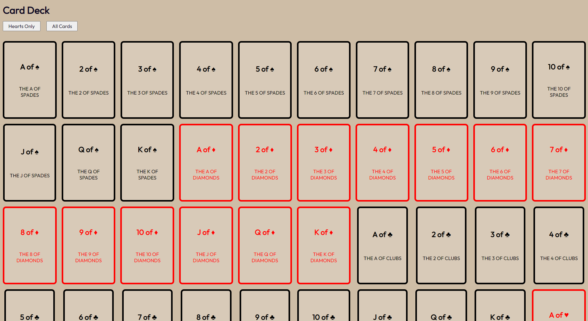
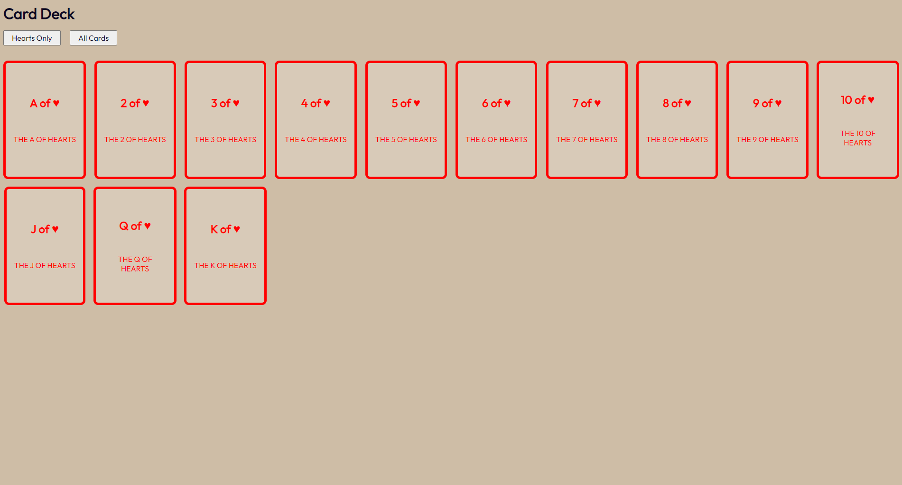

# JS Fundamentals Tech Test

## Requirements

- Using the array of cards and your knowledge of DOM manipulation in JavaScript, display information about 52 cards on your site
- You should aim to reproduce the screen shots provided [here](#final-product)
- There are two buttons on the page which should have the following functionality:
  - "All Cards" : When this is clicked, all cards should show on the screen
  - "Hearts Only" : When this is clicked, it should _filter_ out any cards that do not have the suit of "hearts"
- You will not need to add any new files, and the only file you need to change is `app.js`. However feel free to play around with the `index.html` to find out how all the styles work.
- This should be hosted from your repository using GitHub Pages.

## Notes

- If you haven't used imports in JavaScript before, take a look at the [MDN Docs](https://developer.mozilla.org/en-US/docs/Web/JavaScript/Reference/Statements/import). You will need to find out how to import the `cards` from the `cardsData.js` file into the `app.js` file
- Look at the SCSS file for clues to what the HTML cards should look like
- We're looking for clean code here, make sure you remove extra `console.logs` and commented code, and remember to format your code!

## Final Product

### All Cards (default view)

On page load, as well as when the "All Cards" button has been pressed, it should show all the cards in the array:

### Hearts Only

When the "Hearts Only" button has been pressed, it should only show cards with a suit of "Hearts":

